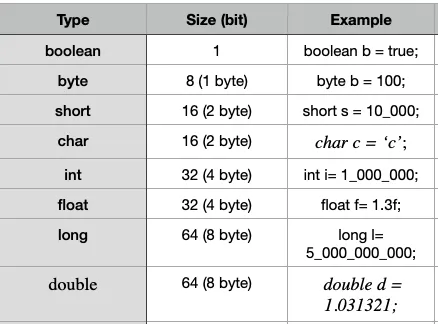

Agenda:

1. Variables and types
2. Switch and case. Try, catch and finally

Let’s start with the general and important things that you really should have learned earlier. Java, like many languages, has two types of variables:

Primitives:
  

Non-Primitive: String, Arrays and Classes.

Usually we need to compare variables, but what methods should we use? “equals” or “== “ ? Let’s look at all the comparison methods available to us:
```dtd
==      equal to
!=      not equal to
>       greater than
>=      greater than or equal to
<       less than
<=      less than or equal to
```

This tricky question was asked in the interview. We can use it with classes, but:
```dtd
// Integer != int
int a = 1, b = 1;
System.out.println(a == b); // true

int c = 1, j = c;
System.out.println(c == j); // true

Integer ai = Integer.valueOf(1), bi = Integer.valueOf(1);
System.out.println(ai == bi); // true 

Integer ci = Integer.valueOf(128), ji = Integer.valueOf(128);
System.out.println(ci == ji); // false
/* You can always count on the fact that 
*  for values between -128 and 127, 
*  you get the identical Integer objects after autoboxing, 
*  and on some implementations you might get identical objects
*  even for higher values.
*/
```

It’s important to learn that the Integer class is not a primitive value, because it is a regular class. Class Object is the root of the class hierarchy. Every class has Object as a superclass. All objects, including arrays, implement the methods of this class.
The “==” operator compares the values of two object references to see if they refer to the same thing. For an object we should use “equals”:

```dtd
// Indicates whether some other object is "equal to" this one.
public boolean equals(Object obj)
```

Or Comparable interface for natural ordering (if you need to sort you collection with own type of object):
```dtd
public class HugePoint implements Comparable<HugePoint> {

    // same as before

    @Override
    public int compareTo(HugePoint otherHugePoint) {
        return Integer.compare(getSize(), otherHugePoint.getSize());
    }

}
```

---- 
**Switch and case. Try, catch and finally**


When we have too many conditions, and they are all tied to the same type of variable in “if-then-else”, it is worth using switch-case.
```dtd
// case 
int expression = 9;
switch(expression) {
  case 2:
    System.out.println("Small Size");
    break;

  case 3:
    System.out.println("Large Size");
    break;
        
  // default case
  default:
    System.out.println("Unknown Size");
}
```
Also, up Java to version 19 or more and we can use expression:
```dtd
Day day = Day.WEDNESDAY;
var resultDay = switch (day) {
        case MONDAY, FRIDAY, SUNDAY -> 6;
        case TUESDAY                -> 7;
        case THURSDAY, SATURDAY     -> 8;
        case WEDNESDAY              -> 9;
        default -> throw new IllegalStateException("Invalid day: " + day);
    } 

System.out.println(resultDay);    
```
